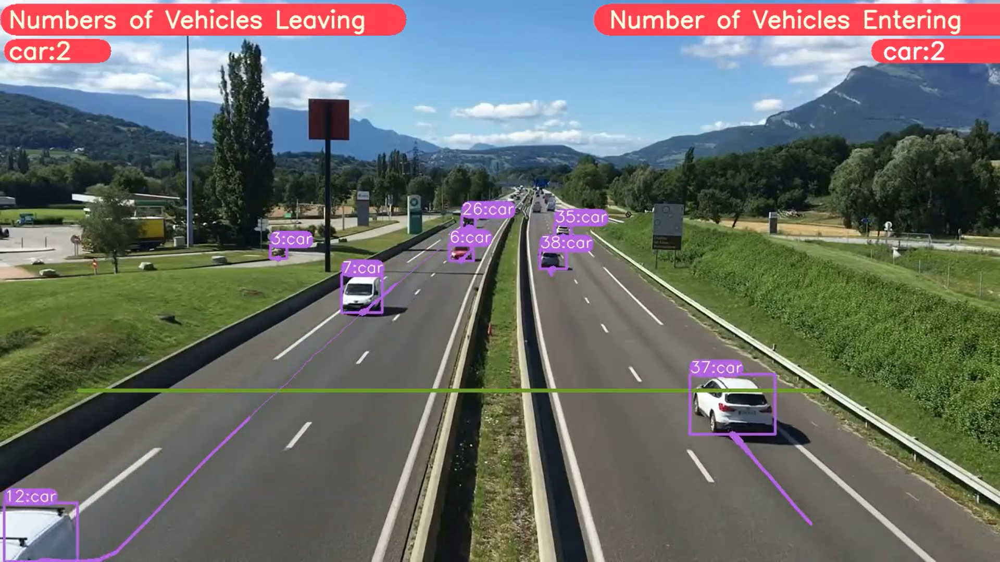

# YOLOv8 Phát Hiện Đối Tượng với DeepSORT Tracking (ID + Trails)

## 🚀 Liên kết Google Colab (Giải pháp chỉ với một cú nhấp chuột)

Bạn có thể chạy YOLOv8 phát hiện và theo dõi đối tượng trong **Google Colab**. Chỉ cần chọn **Runtime** là **GPU**, sau đó nhấn **Run All** để thực thi chương trình.

- **[Liên kết Google Colab - Phát hiện và theo dõi đối tượng](https://colab.research.google.com/drive/1U6cnTQ0JwCg4kdHxYSl2NAhU4wK18oAu?usp=sharing)**

- **[Liên kết Google Colab - Dữ liệu tùy chỉnh](https://colab.research.google.com/drive/1dEpI2k3m1i0vbvB4bNqPRQUO0gSBTz25?usp=sharing)**

## 🛠️ YOLOv8 Phân đoạn với DeepSORT Object Tracking

- **[Liên kết GitHub Repository](https://github.com/GILL-NTD/YOLOv8_Segmentation_DeepSORT_Object_Tracking.git)**

## 📋 Các Bước Để Chạy Mã

Làm theo các bước dưới đây để sao chép kho lưu trữ, cài đặt phụ thuộc và chạy mã cho phát hiện và theo dõi đối tượng.

### 1. Sao chép Kho Lưu Trữ

```bash
git clone https://github.com/GILL-NTD/YOLOv8-DeepSORT-Object-Tracking.git
```

### 2. Chuyển đến Thư Mục Đã Sao Chép

```bash
cd YOLOv8-DeepSORT-Object-Tracking
```

### 3. Cài Đặt Các Phụ Thuộc

```bash
pip install -e '.[dev]'
```

### 4. Cài Đặt Thư Mục

```bash
cd ultralytics/yolo/v8/detect
```

### 5. Tải Các Tệp DeepSORT từ Google Drive

- [Thư Mục Google Drive DeepSORT](https://drive.google.com/drive/folders/1kna8eWGrSfzaR6DtNJ8_GchGgPMv3VC8?usp=sharing)

Sau khi tải tệp zip DeepSORT, giải nén và đặt thư mục `deep_sort_pytorch` vào thư mục `yolo/v8/detect`.

### 6. Tải Video Mẫu từ Google Drive

```bash
gdown "https://drive.google.com/uc?id=1rjBn8Fl1E_9d0EMVtL24S9aNQOJAveR5&confirm=t"
```

### 7. Chạy Mã

- **Đối với YOLOv8 Phát Hiện và Theo Dõi Đối Tượng:**

```bash
python predict.py model=yolov8l.pt source="test3.mp4" show=True
```

- **Đối với YOLOv8 Phát Hiện Đối Tượng + Theo Dõi + Đếm Xe:**

Tải tệp `predict.py` đã cập nhật từ Google Drive và đặt vào thư mục `ultralytics/yolo/v8/detect`.

- [Liên kết Tệp `predict.py` Cập Nhật - Google Drive](https://drive.google.com/drive/folders/1awlzTGHBBAn_2pKCkLFADMd1EN_rJETW?usp=sharing)

Sau đó, chạy mã với lệnh sau:

```bash
python predict.py model=yolov8l.pt source="test3.mp4" show=True
```

## 🎯 Kết Quả

### 🚗 Phát Hiện Xe, Theo Dõi và Đếm Xe



### 🚗 Phát Hiện Xe, Theo Dõi và Đếm Xe


## 🎥 Xem Video Hướng Dẫn Chi Tiết

Để có hướng dẫn chi tiết từng bước, hãy xem video tutorial trên **YouTube**.

- **[Xem Hướng Dẫn Chi Tiết](https://www.youtube.com/watch?v=9jRRZ-WL698)**

[](https://www.youtube.com/watch?v=9jRRZ-WL698)
